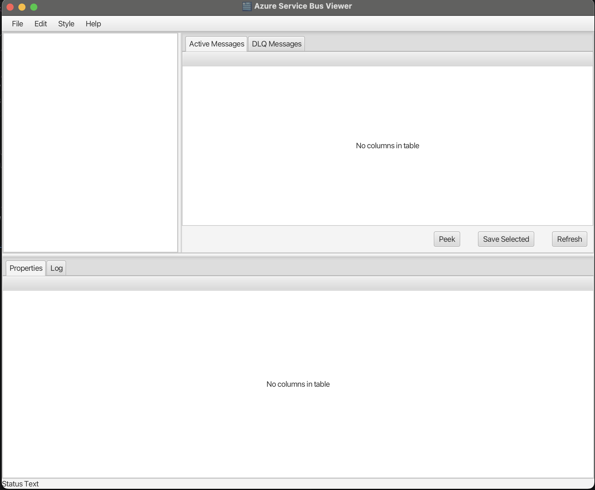

# ServiceBusViewer

ServiceBusViewer is a desktop app for exploring Azure Service Bus queues and topics.
It allows browsing messages and viewing message properties.

## Features
- View queues and topics
- Browse messages
- Inspect message properties

## Tech Stack
- Java
- JavaFX

 
## Installation
Download installables from releases

